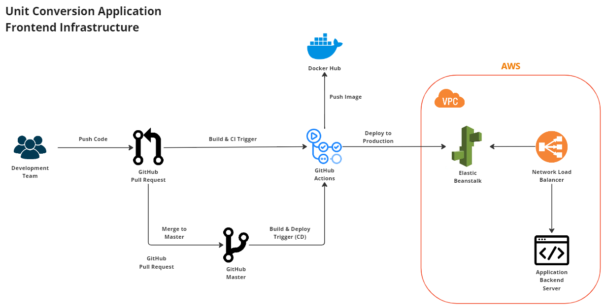

# Unit Conversion Frontend Application

## Problem Statement

Our users are science teachers who are as comfortable using the command line as they are using a browser. In their “Unit Conversion” science unit, they want to assign students unit-conversion problems on paper worksheets. After students turn in their completed worksheets, the teachers want to be able to enter the questions and student responses into a computer to be graded.

Students will convert:

- temperatures between Kelvin, Celsius, Fahrenheit, and Rankine
- volumes between liters, tablespoons, cubic-inches, cups, cubic-feet, and gallons

This repository contains the code for a unit conversion frontend application containing a UI to assist teachers with conversion validation.

Public API Endpoint: [http://unitconversionui.us-east-1.elasticbeanstalk.com/](http://unitconversionui.us-east-1.elasticbeanstalk.com/)

## Installation and Usage

### Prerequisites

- Node.js
- npm

### Installation

1. Clone the repository

```
git clone git@github.com:Kevin1289/unit-conversion-frontend.git
```

2. Install dependencies

```
cd unit-conversion-frontend
npm install
```

### Running the Application Locally

1. Start the application

```
npm start
```

2. Open a browser and navigate to [http://localhost:3000](http://localhost:3000)

### Running the Tests

1. Run the unit tests

```
npm test
```

2. Run the Dependency Vulnerability Check

```
npm run test:security
```

### Code Linting and Formatting

1. Lint the code

```
npm run lint
```

2. Format the code

```
npm run prettier
```

## Documentation

This application provides a UI to assist teachers with conversion validation.

### Assumptions

1. The application only supports the conversion of temperatures between Kelvin, Celsius, Fahrenheit, and Rankine.
2. The application only supports the conversion of volumes between liters, tablespoons, cubic-inches, cups, cubic-feet, and gallons.

### CI/CD Pipeline

1. The CI/CD pipeline is set up using GitHub Actions.
2. The pipeline runs the tests and lints the code on every push to the repository.
3. The pipeline deploys the application to AWS Elastic Beanstalk on every push to the `main` branch.

## Infrastructure

1. The application is deployed on AWS Elastic Beanstalk for several reasons:
   - It is a Platform as a Service (PaaS) that abstracts the underlying infrastructure.
   - It is easy to deploy and manage applications.
   - It provides auto-scaling and load balancing capabilities.
   - It supports multiple programming languages and frameworks.
   - It provides a free tier for new users.
2. The application leverages a network load balancer to distribute incoming traffic across multiple targets.
3. The application is deployed in the `us-east-1` region.
4. The application pushes docker image to Docker Hub for accessability and versioning.


